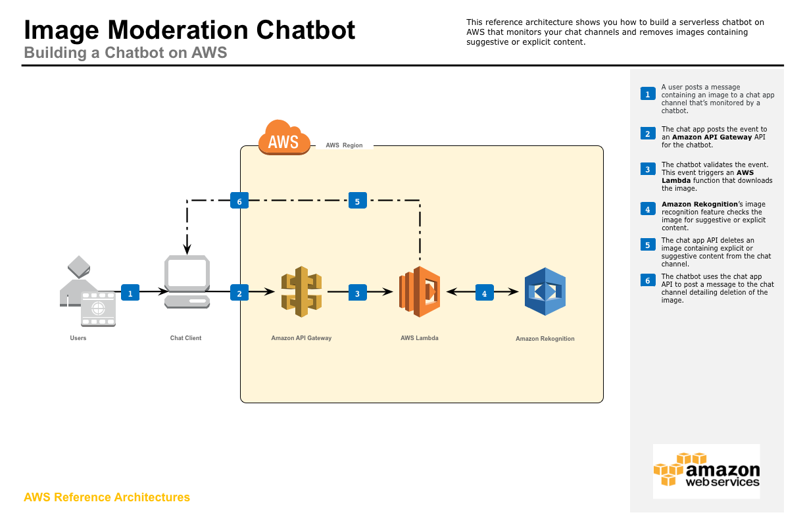

# Serverless Reference Architecture: Image Moderation Chatbot

Administrators of large channels in popular chat apps can struggle to protect their users from trolls posting explicit or suggestive images. The Image Moderation Chatbot [Serverless](https://aws.amazon.com/serverless/#getstarted) reference architecture solves this problem by using [Amazon API Gateway](https://aws.amazon.com/api-gateway/), [AWS Lambda](https://aws.amazon.com/lambda/), and [Amazon Rekognition](https://aws.amazon.com/rekognition/)'s [image moderation](https://aws.amazon.com/rekognition/faqs/#image-moderation) deep learning feature to check images contained in messages posted to channels for explicit or suggestive content. Image moderation provides a hierarchical list of labels for each image with confidence scores to enable fine-grained control over what images to allow. Images found to contain explicit or suggestive content labels above a minimum confidence interval are automatically removed by the bot, and a message explaining the removal is posted by the bot to the originating channel.

This example is intended to work with [Slack](https://slack.com/), but could also be modified to work with other popular chat apps such as [Facebook Messenger](https://www.messenger.com/).

This repository contains sample code for all the Lambda functions depicted in the diagram below as well as an [AWS CloudFormation](https://aws.amazon.com/cloudformation/) template for creating the functions and related resources.

To see some of the other powerful features of Amazon Rekognition in action check out the [Image Recognition and Processing Backend Serverless reference architecture](https://github.com/awslabs/lambda-refarch-imagerecognition)




## Walkthrough of the Architecture
1. A user posts a message containing an image to a chat app channel that’s monitored by a chatbot.
1. The chat app posts the event to an Amazon API Gateway API for the chatbot.
1. The chatbot validates the event. This event triggers an AWS Lambda function that downloads the image.
1. Amazon Rekognition’s image moderation feature checks the image for suggestive or explicit content.
1. The chat app API deletes an image containing explicit or suggestive content from the chat channel.
1. The chatbot uses the chat app API to post a message to the chat channel detailing deletion of the image.


## Running the Example
### Preparing Slack
First make sure you're logged in to Slack, then follow these instructions to prep your bot:
1. [Create an app](https://api.slack.com/apps?new_app=1) ([Documentation](https://api.slack.com/slack-apps#creating_apps))
1. From the `Basic Information` tab under `Settings` take note of the `Verification Token` as it will be required later
1. Navigate to the `OAuth & Permissions` tab under `Features`
1. Under the `Permissions Scopes` section add the following permission scopes
    * channels:history
    * chat:write:bot
    * files:read
    * files:write:user
1. Click `Save Changes`
1. Click `Install App to Team` then `Authorize` then note the `OAuth Access Token` as it will be required later

### Launching the Bot Backend on AWS
#### Option 1: Launch the CloudFormation Template in US West - Oregon (us-west-2)
The backend infrastructure can be deployed in US West - Oregon (us-west-2) using the provided CloudFormation template.
Click **Launch Stack** to launch the template in the US West - Oregon (us-west-2) region in your account:

[](https://console.aws.amazon.com/cloudformation/home?region=us-west-2#/stacks/new?stackName=ImageModerationChatbot&templateURL=https://s3.amazonaws.com/rekognition-image-moderation-chat-app/image_moderator.output.yaml)

(On the last page of the wizard, make sure to:

1. Click the checkboxes to give AWS CloudFormation permission to **"create IAM resources"** and **"create IAM resources with custom names"**
1. Follow the instructions to **"Create Change Set"** 
1. Click **"Execute"**
)

#### Option 2: Launch the CloudFormation Template Manually 
If you would like to deploy the template manually, you need a S3 bucket in the target region, and then package the Lambda functions into that S3 bucket by using the `aws cloudformation package` utility.

Set environment variables for later commands to use:

```bash
S3BUCKET=[REPLACE_WITH_YOUR_BUCKET]
REGION=[REPLACE_WITH_YOUR_REGION]
STACKNAME=[REPLACE_WITH_DESIRED_NAME]
VTOKEN=[REPLACE_WITH_VERIFICATION_TOKEN]
ATOKEN=[REPLACE_WITH_OAUTH_ACCESS_TOKEN]
```

Then go to the `cloudformation` folder and use the `aws cloudformation package` utility

```bash
cd cloudformation

aws cloudformation package --region $REGION --s3-bucket $S3BUCKET --template image_moderator.serverless.yaml --output-template-file image_moderator.output.yaml
```
Last, deploy the stack with the resulting yaml (`image_moderator.output.yaml`) through the CloudFormation Console or command line:

```bash
aws cloudformation deploy --region $REGION --template-file image_moderator.output.yaml --stack-name $STACKNAME --capabilities CAPABILITY_NAMED_IAM --parameter-overrides VerificationToken=$VTOKEN AccessToken=$ATOKEN
```

### Finalize Slack Event Subscription
1. Navigate to the created stack in the CloudFormation console and note the value for the `RequestURL` output from the created stack as it will be required later
1. Return to the Slack app settings page for the Slack app created earlier
1. Navigate to the `Event Subscriptions` tab under `Features` and enable events
1. In the `Request URL` field enter the `RequestURL` value noted earlier
1. Click `Add Workspace Event` and select `message.channels`
1. Click `Save Changes`


## Testing the Example
To test the example open your Slack bot and attempt to upload the sample images from the Amazon Rekognition console demo, which can be downloaded from the links below:
- [Family Picnic](https://dhei5unw3vrsx.cloudfront.net/images/family_picnic_resized.jpg) (will not be removed by bot)
- [Yoga Swimwear](https://dhei5unw3vrsx.cloudfront.net/images/yoga_swimwear_resized.jpg) (will be removed by bot)


## Cleaning Up the Stack Resources

To remove all resources created by this example, do the following:

1. Delete the CloudFormation stack.
1. Delete the CloudWatch log groups associated with each Lambda function created by the CloudFormation stack.

## CloudFormation Template Resources
The following sections explain all of the resources created by the CloudFormation template provided with this example.

### AWS Lambda
- **ImageModeratorFunction** - Lambda function that validates incoming Slack event messages, checks them for images containing explicit content, and orchestrates the removal of images found to contain explicit content from Slack.
- **ImageModeratorFunctionImageModeratorAPIPostPermissionTest** - Implicitly created Lambda permission, allows API Gateway Test stage to call Lambda function.
- **ImageModeratorFunctionImageModeratorAPIPostPermissionProd** - Implicitly created Lambda permission, allows API Gateway Prod stage to call Lambda function.

### AWS IAM
- **ImageModeratorFunctionRole** - Implicitly created IAM Role with policy that allows Lambda function to invoke "rekognition:DetectLabels" and "rekognition:DetectModerationLabels" API calls and write log messages to CloudWatch Logs.

### Amazon API Gateway
- **ImageModeratorAPI:** - API for image moderation chatbot
- **ImageModeratorAPIProdStage** - Implicitly created production stage for API
- **ImageModeratorAPIDeploymentXXXXXXXXX** - Implicitly created deployment for production stage of API


## License

This reference architecture sample is licensed under Apache 2.0.
